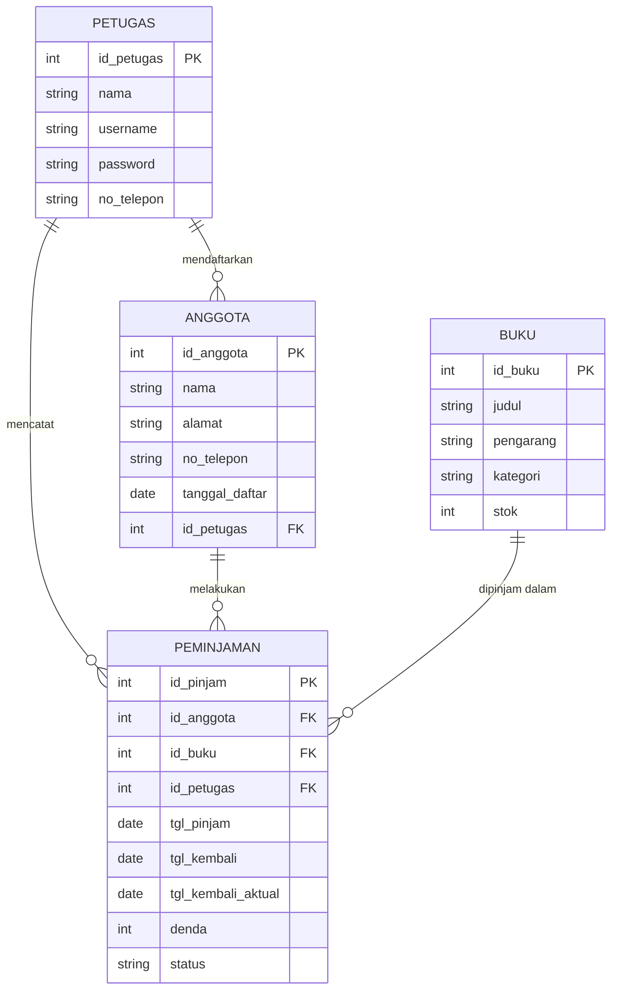

# UAS-Basis-Data-Sistem-Informasi-Perpustakaan-

**Nama**: Flo Raras Fathin  
**NIM**: 25091397132  
**Kelas**: 2025I  

---

## 1. Topik yang Dipilih

**Topik: Sistem Informasi Perpustakaan**

Sistem informasi perpustakaan merupakan sistem yang dirancang untuk membantu pengelolaan kegiatan operasional perpustakaan agar lebih terorganisir. Sistem ini mencakup pengelolaan data anggota, koleksi buku, serta transaksi peminjaman dan pengembalian buku.

Dengan adanya sistem ini, petugas perpustakaan dapat lebih mudah mencatat dan memantau seluruh aktivitas yang terjadi, mulai dari pendaftaran anggota baru, pencatatan buku yang dipinjam, hingga perhitungan denda apabila terjadi keterlambatan pengembalian. Sistem ini juga membantu menghindari kesalahan pencatatan yang sering terjadi apabila data masih dikelola secara manual.

---

## 2. Proses Bisnis dan Modul

a. **Proses Bisnis**: Sistem informasi perpustakaan memiliki alur kerja sebagai berikut. Pertama, anggota baru datang ke perpustakaan dan mendaftarkan diri kepada petugas. Petugas kemudian menginput data anggota ke dalam sistem. Setelah terdaftar, anggota dapat meminjam buku yang tersedia di perpustakaan. Petugas mencatat transaksi peminjaman beserta tanggal batas pengembalian. Ketika anggota mengembalikan buku, petugas mencatat tanggal pengembalian aktual dan menghitung denda apabila pengembalian melebihi batas waktu yang telah ditentukan.

b. **Modul**: Berikut merupakan modul yang terdapat pada sistem informasi perpustakaan tersebut:

| No | Nama Modul | Fungsi |
| :--- | :--- | :--- |
| 1 | Modul Anggota | Mengelola pendaftaran dan data anggota perpustakaan |
| 2 | Modul Buku | Mengelola data koleksi buku yang tersedia di perpustakaan |
| 3 | Modul Peminjaman | Mencatat dan mengelola transaksi peminjaman buku |
| 4 | Modul Pengembalian | Mencatat pengembalian buku dan menghitung denda keterlambatan |

---

## 3. Pihak yang Terlibat dalam Setiap Modul

Pengguna sistem terbagi menjadi dua aktor utama, yaitu Petugas yang mengelola keseluruhan sistem, dan juga Anggota yang meminjam buku. Masing-masing aktor yang terlibat terbagi dalam beberapa modul yang berbeda:

| Modul | Aktor yang Terlibat | Peran |
| :--- | :--- | :--- |
| Modul Anggota | Petugas & Anggota | Petugas menginput data anggota baru |
| Modul Buku | Petugas | Petugas mengelola data koleksi buku |
| Modul Peminjaman | Petugas & Anggota | Petugas mencatat peminjaman atas permintaan anggota |
| Modul Pengembalian | Petugas & Anggota | Petugas mencatat pengembalian dan denda jika ada |

---

## 4. Desain Entity Relationship Diagram (ERD), Entitas, dan Relasi

### Visualisasi ERD



### Deskripsi Entitas dan Atribut

a. **Petugas (Master)**: Menyimpan data petugas perpustakaan. PK: `id_petugas`. Atribut: `nama`, `username` (unik), `password`, dan `no_telepon`.

b. **Anggota (Master)**: Menyimpan data anggota perpustakaan. PK: `id_anggota`. Atribut: `nama`, `alamat`, `no_telepon`, `tanggal_daftar`, dan `id_petugas` (FK).

c. **Buku (Master)**: Menyimpan data koleksi buku. PK: `id_buku`. Atribut: `judul`, `pengarang`, `kategori`, dan `stok`.

d. **Peminjaman (Transaksi)**: Mencatat transaksi peminjaman buku. PK: `id_pinjam`. FK: `id_anggota`, `id_buku`, dan `id_petugas`. Atribut: `tgl_pinjam`, `tgl_kembali`, `tgl_kembali_aktual`, `denda`, dan `status`.

---

## 5. Kardinalitas Relasi Antar Entitas

a. **Petugas ke Anggota**: One to Many (1:N), satu petugas dapat mendaftarkan banyak anggota, tetapi satu anggota hanya didaftarkan oleh satu petugas.

b. **Petugas ke Peminjaman**: One to Many (1:N), satu petugas dapat mencatat banyak transaksi peminjaman, tetapi satu transaksi peminjaman hanya dicatat oleh satu petugas.

c. **Anggota ke Peminjaman**: One to Many (1:N), satu anggota dapat melakukan banyak transaksi peminjaman, tetapi satu transaksi peminjaman hanya dimiliki oleh satu anggota.

d. **Buku ke Peminjaman**: One to Many (1:N), satu buku dapat dipinjam berkali-kali dalam transaksi yang berbeda, tetapi satu transaksi peminjaman hanya mencatat satu buku.

---

## 6. Proses Normalisasi Database

### 6.1. Bentuk Tidak Ternormalisasi (UNF) & 1NF (First Normal Form)

Syarat 1NF adalah setiap kolom harus berisi satu nilai saja (atomik) dan setiap baris harus unik.

| Nama Kolom | Jenis Kunci | Keterangan |
| :--- | :--- | :--- |
| id_petugas | Primary Key | Identitas unik petugas |
| nama | - | Nama lengkap petugas |
| username | - | Username untuk login |
| password | - | Password untuk login |
| no_telepon | - | Nomor telepon petugas |
| id_anggota | Primary Key | Identitas unik anggota |
| nama | - | Nama lengkap anggota |
| alamat | - | Alamat tinggal anggota |
| no_telepon | - | Nomor telepon anggota |
| tanggal_daftar | - | Tanggal anggota mendaftar |
| id_petugas | Foreign Key | Merujuk ke tabel petugas |
| id_buku | Primary Key | Identitas unik buku |
| judul | - | Judul buku |
| pengarang | - | Nama pengarang buku |
| kategori | - | Kategori buku |
| stok | - | Jumlah stok buku tersedia |
| id_pinjam | Primary Key | Identitas unik transaksi peminjaman |
| id_anggota | Foreign Key | Merujuk ke tabel anggota |
| id_buku | Foreign Key | Merujuk ke tabel buku |
| id_petugas | Foreign Key | Merujuk ke tabel petugas |
| tgl_pinjam | - | Tanggal buku dipinjam |
| tgl_kembali | - | Tanggal rencana pengembalian |
| tgl_kembali_aktual | - | Tanggal aktual pengembalian |
| denda | - | Jumlah denda keterlambatan |
| status | - | Status peminjaman |

### 6.2. 2NF (Second Normal Form)

Syarat 2NF adalah sudah memenuhi 1NF dan tidak ada ketergantungan parsial, artinya setiap kolom harus bergantung penuh pada primary key.

#### a. Tabel Petugas

| Nama Kolom | Jenis Kunci | Bergantung pada PK | Keterangan |
| :--- | :--- | :--- | :--- |
| id_petugas | Primary Key | Ya | Identitas unik petugas |
| nama | - | Ya | Nama lengkap petugas |
| username | - | Ya | Username untuk login |
| password | - | Ya | Password untuk login |
| no_telepon | - | Ya | Nomor telepon petugas |

#### b. Tabel Anggota

| Nama Kolom | Jenis Kunci | Bergantung pada PK | Keterangan |
| :--- | :--- | :--- | :--- |
| id_anggota | Primary Key | Ya | Identitas unik anggota |
| nama | - | Ya | Nama lengkap anggota |
| alamat | - | Ya | Alamat tinggal anggota |
| no_telepon | - | Ya | Nomor telepon anggota |
| tanggal_daftar | - | Ya | Tanggal anggota mendaftar |
| id_petugas | Foreign Key | Ya | Merujuk ke tabel petugas |

#### c. Tabel Buku

| Nama Kolom | Jenis Kunci | Bergantung pada PK | Keterangan |
| :--- | :--- | :--- | :--- |
| id_buku | Primary Key | Ya | Identitas unik buku |
| judul | - | Ya | Judul buku |
| pengarang | - | Ya | Nama pengarang buku |
| kategori | - | Ya | Kategori buku |
| stok | - | Ya | Jumlah stok buku tersedia |

#### d. Tabel Peminjaman

| Nama Kolom | Jenis Kunci | Bergantung pada PK | Keterangan |
| :--- | :--- | :--- | :--- |
| id_pinjam | Primary Key | Ya | Identitas unik transaksi peminjaman |
| id_anggota | Foreign Key | Ya | Merujuk ke tabel anggota |
| id_buku | Foreign Key | Ya | Merujuk ke tabel buku |
| id_petugas | Foreign Key | Ya | Merujuk ke tabel petugas |
| tgl_pinjam | - | Ya | Tanggal buku dipinjam |
| tgl_kembali | - | Ya | Tanggal rencana pengembalian |
| tgl_kembali_aktual | - | Ya | Tanggal aktual pengembalian |
| denda | - | Ya | Jumlah denda keterlambatan |
| status | - | Ya | Status peminjaman |

### 6.3. 3NF (Third Normal Form)

Syarat 3NF adalah sudah memenuhi 2NF dan tidak ada ketergantungan transitif, artinya tidak ada kolom yang bergantung pada kolom lain selain primary key. Pada seluruh tabel, setiap kolom hanya bergantung langsung pada primary key masing-masing tabel. Kesimpulan: 3NF terpenuhi.

---

## 7. Implementasi Database di MySQL

Berikut adalah script SQL untuk membuat database dan seluruh tabel yang digunakan dalam sistem informasi perpustakaan:

```sql
-- Buat database
CREATE DATABASE IF NOT EXISTS db_perpustakaan;
USE db_perpustakaan;

-- Tabel petugas
CREATE TABLE petugas (
    id_petugas INT AUTO_INCREMENT PRIMARY KEY,
    nama VARCHAR(100) NOT NULL,
    username VARCHAR(50) NOT NULL UNIQUE,
    password VARCHAR(100) NOT NULL,
    no_telepon VARCHAR(15)
);

-- Tabel anggota
CREATE TABLE anggota (
    id_anggota INT AUTO_INCREMENT PRIMARY KEY,
    nama VARCHAR(100) NOT NULL,
    alamat TEXT,
    no_telepon VARCHAR(15),
    tanggal_daftar DATE NOT NULL,
    id_petugas INT,
    FOREIGN KEY (id_petugas) REFERENCES petugas(id_petugas)
);

-- Tabel buku
CREATE TABLE buku (
    id_buku INT AUTO_INCREMENT PRIMARY KEY,
    judul VARCHAR(200) NOT NULL,
    pengarang VARCHAR(100),
    kategori VARCHAR(50),
    stok INT DEFAULT 1
);

-- Tabel peminjaman
CREATE TABLE peminjaman (
    id_pinjam INT AUTO_INCREMENT PRIMARY KEY,
    id_anggota INT NOT NULL,
    id_buku INT NOT NULL,
    id_petugas INT NOT NULL,
    tgl_pinjam DATE NOT NULL,
    tgl_kembali DATE NOT NULL,
    tgl_kembali_aktual DATE,
    denda INT DEFAULT 0,
    status ENUM('dipinjam','dikembalikan') DEFAULT 'dipinjam',
    FOREIGN KEY (id_anggota) REFERENCES anggota(id_anggota),
    FOREIGN KEY (id_buku) REFERENCES buku(id_buku),
    FOREIGN KEY (id_petugas) REFERENCES petugas(id_petugas)
);
```

---

## 8. Perintah SQL Insert, Update, dan Delete

### a. Insert (Menambah Data)

```sql
USE db_perpustakaan;

-- Insert data petugas
INSERT INTO petugas (nama, username, password, no_telepon) VALUES
('Flo Raras Fathin', 'flo',   'pass123', '081234560001'),
('Nayra Mentari',    'nayra', 'pass123', '081234560002');

-- Insert data anggota
INSERT INTO anggota (nama, alamat, no_telepon, tanggal_daftar, id_petugas) VALUES
('Putri Olivia',    'Jl. Raya Darmo No. 12, Surabaya',      '082100000001', '2026-05-10', 1),
('Berlianti Widya', 'Jl. Gubeng Jaya No. 5, Surabaya',      '082100000002', '2026-05-15', 1),
('Shella Monica',   'Jl. Kenjeran No. 88, Surabaya',        '082100000003', '2026-05-20', 2),
('Nabillah Fitari', 'Jl. Rungkut Industri No. 3, Surabaya', '082100000004', '2026-06-01', 2);

-- Insert data buku
INSERT INTO buku (judul, pengarang, kategori, stok) VALUES
('Laskar Pelangi',       'Andrea Hirata',     'Novel',     3),
('Bumi Manusia',         'Pramoedya Ananta',  'Novel',     2),
('Pemrograman Python',   'Farid Azis',        'Teknologi', 2),
('Dasar-Dasar Database', 'Hendra Saputra',    'Teknologi', 4),
('Psikologi Komunikasi', 'Jalaludin Rakhmat', 'Sosial',    1);

-- Insert data peminjaman
INSERT INTO peminjaman (id_anggota, id_buku, id_petugas, tgl_pinjam, tgl_kembali, status) VALUES
(1, 1, 1, '2026-05-20', '2026-06-03', 'dikembalikan'),
(2, 3, 1, '2026-05-28', '2026-06-11', 'dipinjam'),
(3, 2, 2, '2026-06-01', '2026-06-15', 'dipinjam'),
(4, 4, 2, '2026-06-03', '2026-06-17', 'dipinjam');
```

### b. Update (Mengubah Data)

```sql
-- Mencatat pengembalian buku dan denda keterlambatan
UPDATE peminjaman
SET tgl_kembali_aktual = '2026-06-05',
    denda = 2000,
    status = 'dikembalikan'
WHERE id_pinjam = 1;

-- Memperbarui nomor telepon Shella Monica
UPDATE anggota
SET no_telepon = '085600001111'
WHERE id_anggota = 3;
```

### c. Delete (Menghapus Data)

```sql
-- Menghapus data peminjaman yang sudah selesai
DELETE FROM peminjaman WHERE id_pinjam = 1;
```

---

## 9. Aplikasi CRUD Menggunakan Python dan PHP

Pada soal ini, saya membuat aplikasi CRUD untuk mengelola 2 tabel master yaitu tabel petugas dan tabel anggota. Aplikasi saya buat dalam dua versi, yaitu berbasis terminal menggunakan Python dan berbasis web menggunakan PHP.

### 9.1. Aplikasi Python

Saya membuat aplikasi berbasis terminal (command line) menggunakan bahasa pemrograman Python. Untuk menghubungkan Python dengan database MySQL, saya menggunakan library `mysql-connector-python`. Pengguna dapat berinteraksi dengan aplikasi melalui menu angka yang muncul di layar.

a. **Library yang digunakan**: Pada aplikasi ini, saya menggunakan library `mysql-connector-python`, yang berfungsi sebagai penghubung Python dengan database MySQL.

b. **Fitur yang dibuat**: Aplikasi ini mencakup 4 fitur utama yang tersedia untuk tabel petugas maupun tabel anggota, yaitu menambah data (Create), melihat data (Read), mengubah data (Update), dan menghapus data (Delete).

c. **Cara menjalankan aplikasi**: Setelah library terinstall, aplikasi dijalankan melalui Command Prompt dengan perintah `python crud_perpustakaan.py`. Selanjutnya akan muncul menu utama di layar dan pengguna dapat memilih menu dengan mengetikkan angka yang sesuai.

d. **Kode-kode yang digunakan**:

Kode koneksi database yang digunakan:

```python
import mysql.connector

KONFIG_DB = {
    "host":     "localhost",
    "user":     "root",
    "password": "",
    "database": "db_perpustakaan"
}

def koneksi():
    conn = mysql.connector.connect(**KONFIG_DB)
    return conn
```

Kode fungsi tambah petugas:

```python
def tambah_petugas():
    nama     = input("Nama lengkap  : ").strip()
    username = input("Username      : ").strip()
    password = input("Password      : ").strip()
    telepon  = input("No. telepon   : ").strip()
    conn   = koneksi()
    cursor = conn.cursor()
    cursor.execute(
        "INSERT INTO petugas (nama, username, password, no_telepon) VALUES (%s,%s,%s,%s)",
        (nama, username, password, telepon)
    )
    conn.commit()
    conn.close()
```

Kode fungsi lihat data anggota:

```python
def tampil_semua_anggota():
    conn   = koneksi()
    cursor = conn.cursor()
    cursor.execute("""
        SELECT a.id_anggota, a.nama, a.no_telepon,
               a.tanggal_daftar, p.nama
        FROM anggota a
        LEFT JOIN petugas p ON a.id_petugas = p.id_petugas
        ORDER BY a.id_anggota
    """)
    data = cursor.fetchall()
    for row in data:
        print(row)
    conn.close()
```

### 9.2. Aplikasi PHP

Saya membuat aplikasi berbasis web menggunakan bahasa PHP dengan tampilan antarmuka di browser. Aplikasi berjalan di atas server lokal XAMPP dan menggunakan MySQLi untuk koneksi ke database.

a. **Teknologi yang digunakan**: Menggunakan PHP yang dijalankan di atas server lokal XAMPP. Untuk koneksi ke database saya menggunakan MySQLi yang merupakan ekstensi bawaan PHP, sedangkan tampilan antarmukanya saya buat menggunakan HTML dan CSS agar mudah digunakan melalui browser.

b. **Fitur yang dibuat**: Sama seperti aplikasi Python, aplikasi PHP ini juga mencakup 4 fitur utama yaitu menambah, melihat, mengubah, dan menghapus data yang masing-masing tersedia untuk tabel petugas dan tabel anggota. Tampilan aplikasi dibagi menjadi dua tab, yaitu tab Petugas dan tab Anggota.

c. **Cara mengakses aplikasi**: Untuk menjalankan aplikasi, saya menyimpan file `perpustakaan.php` di dalam folder `C:\xampp\htdocs\perpustakaan\`. Setelah XAMPP dinyalakan dan Apache serta MySQL sudah berstatus Running, aplikasi dapat diakses melalui browser dengan mengetikkan alamat `http://localhost/perpustakaan/perpustakaan.php`.

d. **Kode-kode yang digunakan**:

Kode koneksi database yang digunakan:

```php
<?php
define('DB_HOST', 'localhost');
define('DB_USER', 'root');
define('DB_PASS', '');
define('DB_NAME', 'db_perpustakaan');

function koneksi() {
    $conn = new mysqli(DB_HOST, DB_USER, DB_PASS, DB_NAME);
    $conn->set_charset('utf8');
    return $conn;
}
?>
```

Kode proses tambah anggota:

```php
if ($aksi === 'tambah' && $modul === 'anggota') {
    $nama    = trim($_POST['nama']);
    $alamat  = trim($_POST['alamat']);
    $telepon = trim($_POST['telepon']);
    $tgl     = trim($_POST['tanggal_daftar']);
    $id_p    = (int)$_POST['id_petugas'];
    $stmt = $conn->prepare(
        "INSERT INTO anggota (nama, alamat, no_telepon, tanggal_daftar, id_petugas)
         VALUES (?,?,?,?,?)"
    );
    $stmt->bind_param('ssssi', $nama, $alamat, $telepon, $tgl, $id_p);
    $stmt->execute();
}
```
